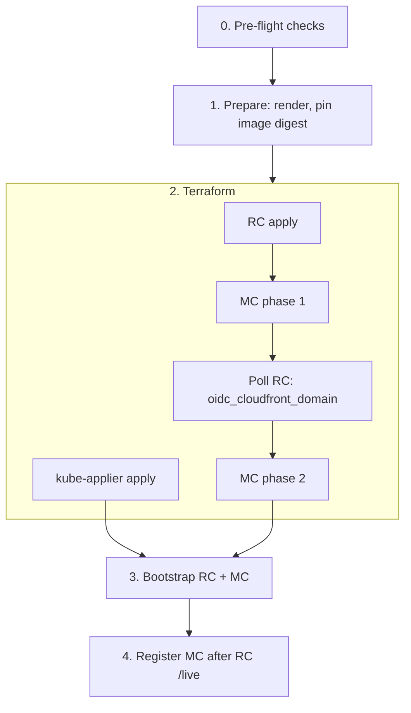
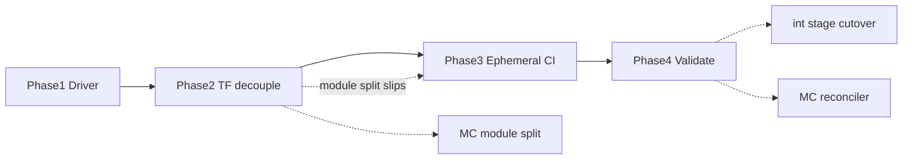

# Environment Provisioning Driver

## Summary

All environments (ephemeral, integration, stage, production) are provisioned by a **single driver** ([`scripts/provision-environment.sh`](../../scripts/provision-environment.sh)) that applies the existing Terraform cluster roots — RC, per-MC kube-applier, and MC — each with its **own state file**, then runs ECS Fargate bootstrap and Platform API MC registration.

The [three-tier CodePipeline hierarchy](pipeline-based-lifecycle.md) (`pipeline-provisioner` → per-cluster pipelines) is replaced by direct Terraform orchestration. **No CodePipeline** is used for cluster provision.

Ephemeral uses the same driver with a default of **1 RC + 1 MC** and full-environment teardown. Long-lived environments differ only in config identity, trigger, and lifecycle.

## Motivation

1. **Complexity cliff** — Provisioning spans ~15 files across Terraform configs, bash buildspecs, CodePipelines, ECS bootstrap, and a Python orchestrator.
2. **Pipeline-based MC provisioning is a dead end** — the MC reconciler must add MCs without git commits or pipeline spawning.
3. **Developer experience** — ephemeral provision should be one command from a git commit, not meta-pipeline bootstrap plus chained CodePipelines.

## Requirements

- Simpler than Terraform + three-tier CodePipeline; MC reconciler calls the same per-MC apply API.
- GitOps: [`render.py`](../../scripts/render.py) → git → driver `apply` when Terraform inputs change; ArgoCD syncs workloads from `deploy/`.
- Shared AWS accounts: multiple environments coexist via `regional_id` / `management_id` naming.
- Dev/CI parity: full isolated environment in ~30 minutes; FedRAMP unchanged (existing modules).
- Ephemeral: commit-pinned or on-demand via CLI. Default scale **1 RC + 1 MC**.

## Alternatives Considered

| Alternative                                                                              | Verdict                                                               |
| ---------------------------------------------------------------------------------------- | --------------------------------------------------------------------- |
| Keep three-tier CodePipeline                                                             | Rejected as provision engine                                          |
| CloudFormation ([PR #742](https://github.com/openshift-online/rosa-hyperfleet/pull/742)) | Rejected — stay on Terraform                                          |
| Single combined Terraform state                                                          | Rejected — blocks per-MC lifecycle                                    |
| Terragrunt                                                                               | Rejected — `dependency` serializes RC/MC; no two-phase MC primitive   |
| EventBridge + Step Functions                                                             | Deferred — run tracking / durable orchestration; not in initial scope |
| **Direct Terraform driver (chosen)**                                                     | One orchestration path; no CodePipeline                               |

## In scope

The following improvements are part of this decision and the implementation plan below.

1. Unified driver CLI — `plan` / `apply` / `destroy`, `--env`, `--region`, `--roots`
2. Consolidate orchestration into `provision-environment.sh` + shared Terraform helpers
3. Pre-flight checks before Terraform (config, credentials, state backend)
4. Selective apply on update — diff `deploy/` and plan/apply only changed roots
5. Trim MC `rhobs_api_url` apply gate ([`provision-infra-mc.sh`](../../scripts/buildspec/provision-infra-mc.sh))
6. Constructed MC locals — derive OIDC bucket / IAM ARNs from config; minimize RC output polls
7. Partial destroy per MC — `--roots` limits teardown to individual MCs (reconciler-ready API)
8. No CodePipeline for cluster provision
9. [`ephemeral-provider`](../../ci/ephemeral-provider/) wrapper only; int/stage call driver directly
10. Optional `--commit` pin for ephemeral provision
11. Driver logs per root to Prow `ARTIFACT_DIR`
12. `management_clusters` decoupling — remove MC list from RC Terraform config (autoscaling prerequisite)
13. MC module/layer split — replace `-target` two-phase apply with proper module boundaries
14. Retire central-account cluster Terraform; central keeps DNS delegation + shared ECR only
15. Driver `plan` for ephemeral CI and on-demand validation (int/stage plan gate is future)

## Design

### Driver CLI

[`scripts/provision-environment.sh`](../../scripts/provision-environment.sh) is the single entrypoint for all environments:

```text
provision-environment.sh <plan|apply|destroy> \
  --env <ephemeral|integration|stage|production> \
  --region <aws-region> \
  [--roots rc,kube-applier,mc01,mc02,...] \
  [--id <eph-id>] \
  [--commit <sha>]
```

- **`plan` / `apply` / `destroy`** — one invocation can target all roots or a subset via `--roots`.
- **`--env` / `--region`** — select rendered config under `deploy/<env>/<region>/`.
- **`--roots`** — enables selective apply on update and partial MC destroy. Omit to run the full environment graph.
- **`--commit`** — ephemeral only; clone and render at a pinned SHA instead of branch HEAD.
- **Logging** — each root writes Terraform output to `ARTIFACT_DIR` (or a local log dir) as a separate file.

Shared helpers centralize backend init, variable injection, state locking, and exit-code handling currently duplicated across buildspec scripts.

**Pre-flight** runs before any Terraform command: rendered `deploy/` exists, AWS credentials resolve for RC and MC accounts, state buckets are reachable, and required `TF_VAR_*` inputs are present. Fail fast with a single error summary.

### Provision flow



1. **Pre-flight** — validate config, credentials, and backends.
2. **Prepare** — `render.py`, git push of `deploy/`, resolve platform image tag to immutable ECR digest (`repository@sha256:...`). Missing tag is fail-fast.
3. **Terraform** — in parallel: RC apply ([`terraform/config/regional-cluster/`](../../terraform/config/regional-cluster/)), kube-applier apply ([`terraform/config/kube-applier-dynamodb-provisioning/`](../../terraform/config/kube-applier-dynamodb-provisioning/)), MC phase 1 (VPC/EKS; interim `-target` until MC module split lands); poll RC state for `oidc_cloudfront_domain` only; MC phase 2. Do **not** gate MC apply on `rhobs_api_url`.
4. **Bootstrap + register** — [`bootstrap-argocd.sh`](../../scripts/bootstrap-argocd.sh) for RC and MC in parallel; [`register.sh`](../../scripts/buildspec/register.sh) after RC Platform API `/live` (HTTPS). Registration does not wait for MC ArgoCD.

One driver command runs all roots (three separate Terraform plan/apply outputs, not one combined graph). Ephemeral CI may run `plan` before `apply` without changing the apply path.

### Selective apply on update

On **initial provision**, all roots are applied unconditionally — there is no prior baseline to diff against.

On **resync or update**, the driver diffs the rendered `deploy/<env>/<region>/` tree against the last-applied revision (git diff or manifest of pipeline input files). Only roots whose Terraform inputs changed are planned and applied. Unchanged MC roots are skipped. This keeps update latency low as `provision_mcs` grows.

The `--roots` flag provides the same granularity for manual and reconciler-driven operations.

### Terraform state layout

Each root uses the same state keys as the [pipeline-based lifecycle](pipeline-based-lifecycle.md). Locking uses S3 native lock files (`use_lockfile=true`).

| Root         | State bucket                                             | State key                                        |
| ------------ | -------------------------------------------------------- | ------------------------------------------------ |
| RC           | RC account: `terraform-state-${rc_account_id}-${region}` | `regional-cluster/${regional_id}.tfstate`        |
| MC           | MC account: `terraform-state-${mc_account_id}-${region}` | `management-cluster/${management_id}.tfstate`    |
| kube-applier | RC account (same bucket as RC)                           | `kube-applier-dynamodb/${management_id}.tfstate` |

Roots: [`regional-cluster`](../../terraform/config/regional-cluster/), [`management-cluster`](../../terraform/config/management-cluster/), [`kube-applier-dynamodb-provisioning`](../../terraform/config/kube-applier-dynamodb-provisioning/). No combined environment state file.

### Environment identity

Identity is deterministic from config and environment class.

**`eph_prefix` resolution** ([`make_eph_prefix`](../../ci/ephemeral-provider/main.py)):

| Input                              | Result                       |
| ---------------------------------- | ---------------------------- |
| `--id foo` (explicit)              | `eph-foo`                    |
| `BUILD_ID` env (CI, no `--id`)     | `eph-{sha256(BUILD_ID)[:6]}` |
| Random UUID (local provision only) | `eph-{uuid[:8]}`             |

Rendered IDs ([`render.py`](../../scripts/render.py)): `regional_id = {eph_prefix}-regional`, `management_id = {eph_prefix}-{mc_key}` (e.g. `eph-abc-mc01`). int/stage/prod use fixed names from `config/<env>/` (e.g. `regional`, `mc01`).

Ephemeral teardown resolves keys from `--id` / `BUILD_ID` → `eph_prefix` and fixed patterns (`{eph_prefix}-regional`, `{eph_prefix}-mc01`). Persisting a frozen provision-time inventory file is [future work](#future-improvements).

### Cross-cluster dependencies

Dependencies cross state boundaries via the driver (polling, `TF_VAR_*`, two-phase MC apply), not a single Terraform graph.

| Need                     | Handling                                                                           |
| ------------------------ | ---------------------------------------------------------------------------------- |
| Account IDs, cluster IDs | From rendered config                                                               |
| OIDC bucket / IAM ARNs   | Constructed locals in MC apply; no RC poll                                         |
| OIDC CloudFront domain   | Driver polls RC state; MC phase 2 after phase 1                                    |
| ZOA ARNs                 | Poll RC when present; MC skips `module.zoa_lambda` when `zoa_lambda_ecr_url` empty |
| `rhobs_api_url`          | ECS bootstrap only — not an MC apply gate                                          |
| ArgoCD / MC registration | ECS bootstrap after all roots; register after RC `/live` only                      |

### `management_clusters` decoupling

Today the RC Terraform root embeds the MC list, forcing an RC apply when MCs are added. In scope:

- Move MC membership to rendered config + driver inventory only.
- RC Terraform no longer depends on `provision_mcs` for resource creation.
- Adding MC02+ is a driver `apply --roots kube-applier,mc02` without RC `terraform apply`.

This unblocks MC autoscaling and the reconciler control loop without requiring the reconciler in this spike.

### MC module split

Replace the interim `-target` two-phase MC apply with explicit Terraform module layers:

1. **Foundation** — VPC, EKS, IAM (no RC output dependency).
2. **Integration** — resources requiring `oidc_cloudfront_domain` from RC.

The driver runs `terraform apply` per layer instead of `-target`. Layer boundaries are documented in the MC root so future roots can be added without new driver primitives.

### Central account retirement

The central AWS account retains:

- Environment-zone DNS (NS delegation via `aws.central` in the RC root).
- Shared ECR repositories.

Cluster provision pipelines, meta-pipeline Terraform, and central-account cluster apply roles are removed as part of this work. Ephemeral and int/stage provision credentials drop `rrp-central` for cluster Terraform (Vault change coordinated with ops).

### Destroy

Ordered multi-root `terraform destroy` on environment identity keys. Synchronous destroy on the Terraform driver path; async teardown may be revisited later.

**Partial destroy:** `--roots mc01` destroys only that MC's MC + kube-applier state. Full ephemeral teardown omits `--roots` and destroys all MCs, then RC.

**Pre-destroy (best-effort):** purge hosted clusters and bundles via Platform API when reachable ([`orchestrator.py`](../../ci/ephemeral-provider/orchestrator.py) `_purge_clusters` paths). On failure, log and continue — see [Accepted risks (ephemeral CI)](#accepted-risks-ephemeral-ci).

Per MC (when in scope), then RC for full teardown:

1. `terraform destroy` MC state — fail-loud on non-zero exit.
2. `terraform destroy` kube-applier state (RC account).
3. `terraform destroy` RC state.

Retry with the same `--id`. [aws-nuke janitor](../../ci/janitor/README.md) remains the CI account safety net.

### Outside Terraform

- **ECS ArgoCD bootstrap** — private EKS APIs; Fargate task after apply ([fully-private-eks-bootstrap](fully-private-eks-bootstrap.md)).
- **MC registration** — HTTPS `POST` after RC `/live`; not a Terraform resource.
- **Central account** — DNS + shared ECR only; no cluster provision pipelines.

### Environment differences (lifecycle only)

|               | Ephemeral                                                     | int / stage / prod                |
| ------------- | ------------------------------------------------------------- | --------------------------------- |
| Default scale | 1 RC + 1 MC (`provision_mcs.mc01`)                            | Config-driven                     |
| Entry         | [`ephemeral-provider`](../../ci/ephemeral-provider/) → driver | SOP / `make` / driver CLI         |
| Git           | Ephemeral branch on fork per run                              | `main` / env branch               |
| Trigger       | CLI / Prow job (`BUILD_ID`) — not CodePipeline                | Same driver on git push or manual |
| Teardown      | Full env (`--teardown`)                                       | MC day-2 only; RC long-lived      |
| Plan gate     | Driver `plan` in CI / on-demand                               | Future                            |

**Ephemeral triggers:**

- **CI / commit pin** — `--repo`, `--branch`, optional `--commit` → clone → render → push ephemeral branch → driver `plan` (optional) → driver `apply`.
- **On-demand** — `make ephemeral-provision`; orchestrator is the trigger (no pipeline webhook). Source branch must be pushed to remote before provision.

**Resync** — rebase ephemeral branch, re-render, driver `apply` on changed roots only.

### Accepted risks (ephemeral CI)

| Risk                                              | Mitigation                                                       |
| ------------------------------------------------- | ---------------------------------------------------------------- |
| Skipped/failed API purge before destroy           | Continue with `terraform destroy`; janitor                       |
| Stale MC registry after infra gone                | Accepted in CI accounts                                          |
| Partial `terraform destroy`                       | Fail-loud; retry same `--id`                                     |
| `BUILD_ID` hash truncated to 6 hex chars          | Low collision probability at current concurrency                 |
| Resync changes `provision_mcs` identity           | Operator error; frozen inventory is future                       |
| Provision/teardown overlap (same `--id`)          | CI job ordering; S3 manifest fencing is future                   |
| Vault coordination delayed for central retirement | Phase 3 blocked on `rrp-central` trim; coordinate with ops early |

## Future improvements

Deferred work. The in-scope design avoids blocking these paths.

| #   | Improvement                                                             | Design guardrails                                                                    |
| --- | ----------------------------------------------------------------------- | ------------------------------------------------------------------------------------ |
| 1   | Trim register/bootstrap RC polling — shared `/live` wait helper         | Driver wait steps are isolated functions, not inlined in Terraform helpers           |
| 2   | Single update contract — render → driver → ArgoCD as one documented SOP | Driver handles Terraform roots only; ArgoCD sync stays separate                      |
| 3   | Frozen identity / teardown keys — persist provision-time inventory      | `--roots` and `--id` API stable; inventory file can wrap existing key resolution     |
| 4   | int/stage cutover + delete pipeline Terraform/scripts                   | Same driver CLI and state layout; ephemeral proves the path first                    |
| 5   | S3 environment manifest + teardown fencing                              | Identity today is config-derived; manifest adds registry without changing state keys |
| 6   | Symmetric MC deregister / stricter int-stage teardown                   | Partial destroy per MC is the primitive; deregister adds API + ordering              |
| 7   | Plan gate in CI for int/stage                                           | Ephemeral `plan` (in scope) validates the same code path                             |
| 8   | MC reconciler control loop                                              | MC decoupling + partial destroy + per-MC `--roots` apply                             |
| 9   | Run tracking (Step Functions / S3 run registry)                         | Driver is stateless per invocation; tracking wraps the CLI                           |
| 10  | Progressive MC rollout — revision per MC with health gate               | Selective apply + `--roots` enable per-MC rollout without new driver                 |
| 11  | Account mint/claim for MCs in new accounts                              | Per-MC state keys and account ID from config already support new accounts            |
| 12  | Per-ephemeral pipelines                                                 | Rejected as provision engine; may revisit for audit if driver logging insufficient   |
| 13  | `--teardown-fire-and-forget`                                            | Sync destroy in scope; async option can layer on driver `destroy`                    |
| 14  | Strict ephemeral deregister                                             | Full teardown sufficient for CI; formal deregister aligns with symmetric deregister  |

## Implementation plan

Phases are ordered so each step delivers ephemeral value without blocking future work.

### Phase 1 — Driver foundation

- `provision-environment.sh` with `plan` / `apply` / `destroy`, `--env`, `--region`, `--roots`
- Shared Terraform helpers (backend init, vars, locking, logging)
- Pre-flight checks
- MC two-phase apply (interim `-target`) + parallel RC / kube-applier / MC phase 1
- Constructed MC locals for OIDC bucket / IAM ARNs

**Exit criteria:** Local and CI can `apply` a full ephemeral 1 RC + 1 MC environment via the driver.

### Phase 2 — Terraform module and config decoupling

- `management_clusters` decoupling — RC root no longer owns MC list
- MC module/layer split — replace `-target` with foundation + integration layers
- Retire central-account cluster Terraform; trim ephemeral Vault creds

**Exit criteria:** MC02 can be added with `apply --roots kube-applier,mc02` and no RC apply. Vault `rrp-central` removal for cluster Terraform coordinated with ops. Module split (no `-target`) is the target exit; if it slips, Phase 3 may proceed with interim `-target` and the split lands as a follow-on PR.

### Phase 3 — Ephemeral CI cutover

- Rewire [`ephemeral-provider`](../../ci/ephemeral-provider/) to call driver; remove pipeline bootstrap/wait
- Trim MC `rhobs_api_url` apply gate in buildspecs / driver
- Selective apply on update (diff `deploy/`, changed roots only)
- Ephemeral `plan` in CI / on-demand
- Driver logs per root → `ARTIFACT_DIR`; drop `codebuild_logs.py`
- `--commit` pin in `main.py`
- Partial destroy per MC (`--roots`); sync ephemeral teardown
- Drop `--teardown-fire-and-forget` on Terraform path (async teardown deferred)

**Exit criteria:** Prow `provision-ephemeral` → `e2e-tests` → `teardown-ephemeral` runs entirely on the driver. No CodePipeline for cluster provision.

#### CI changes (phase 3)

Prow shape stays `provision-ephemeral` → `e2e-tests` → `teardown-ephemeral` ([openshift/release](https://github.com/openshift/release/tree/master/ci-operator/config/openshift-online/rosa-hyperfleet)).

**Preserve:** `BUILD_ID` across steps; `--save-regional-state` / `--save-management-state` → `SHARED_DIR` for [`ci/e2e-tests.sh`](../../ci/e2e-tests.sh); `--teardown` with same id.

| Area                               | Change                                                               |
| ---------------------------------- | -------------------------------------------------------------------- |
| `orchestrator.py`                  | Call driver; remove pipeline bootstrap/wait/teardown                 |
| `pipeline.py`, `codebuild_logs.py` | Remove or replace with driver logs → `ARTIFACT_DIR`                  |
| `main.py`                          | Drop `--teardown-fire-and-forget`; optional `--commit`               |
| `aws.py`                           | Ephemeral: `rrp-rc` + `rrp-mc` only (no `rrp-central` for provision) |
| Vault ephemeral creds              | Trim `aws_config` (coordinate with ops)                              |
| `ci/README.md`, ci-troubleshooter  | Update triage path (driver/Prow logs, not CodePipeline)              |

**Unchanged:** validation jobs, `nightly-integration`, `nightly-stage`, janitor, `e2e-tests.sh` (if TF outputs still saved).

### Phase 4 — Validation and handoff

- E2E ephemeral validation on nightly and on-demand jobs
- Update [`development-environment.md`](../development-environment.md) — account profiles (`rrp-ephemeral-*`), `accounts.json` schema (drop `central` key), Makefile targets
- Update operator docs and ci-troubleshooter paths
- Document driver contract for int/stage cutover and reconciler handoff

**Exit criteria:** Ephemeral is production-ready on the driver. int/stage remain on pipelines until cutover (future #4); reconciler until control loop (future #8).



## Consequences

### Positive

- One provision path for ephemeral; same contract for int/stage cutover later.
- No central-account Terraform super-user for cluster apply.
- Parallel RC + kube-applier + MC phase 1; narrow RC output poll; constructed MC locals.
- Per-MC state keys, partial destroy, and decoupled MC config — reconciler-ready without the control loop.
- Selective apply on update keeps update cost flat as MC count grows.
- Ephemeral `plan` catches TF errors before apply.

### Negative

- Three state files and locks per MC.
- Cross-account dependencies via driver polling until MC module split completes.
- Ephemeral teardown/registry contracts relaxed (see accepted risks).
- Debugging moves from CodePipeline console to driver / Prow artifacts.
- MC decoupling and module split are structural Terraform changes — higher phase-2 risk than CI rewire alone.

## Related documents

- [Pipeline-Based Lifecycle](pipeline-based-lifecycle.md) — superseded for new provision; existing int/stage until cutover (future #4)
- [ECS Fargate Bootstrap](fully-private-eks-bootstrap.md)
- [Regional OIDC Ownership](regional-oidc-ownership.md)
- [Kube-Applier Architecture](kube-applier-architecture.md)
- [Development Environment](../development-environment.md)
- [Testing Strategy](testing-strategy.md)
