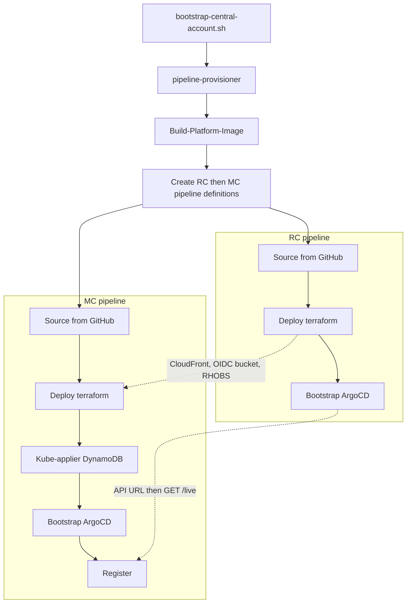
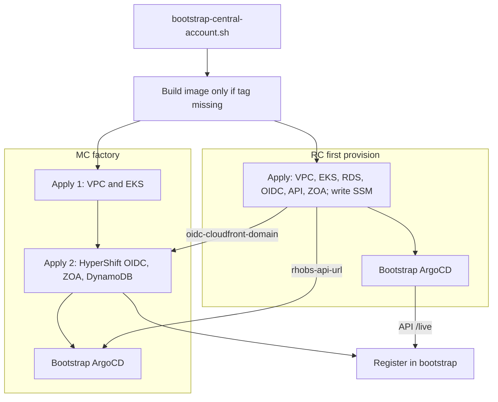

# Optimize CodePipeline: Direct Provisioning, Parallel RC/MC, MC Autoscaling Compatibility

**Last Updated Date**: 2026-09-17

## Context

**Today**

- Three hops: bootstrap → `pipeline-provisioner` → sequential RC then MC **pipeline definitions** → cluster pipelines Source from GitHub and apply.
- MC Deploy polls RC terraform outputs (90×30s, 45 min) before it can plan.
- Identity is git keys (`provision_mcs: mc01: {}`) baked into RC as `management_clusters=mc01:account`. Cannot grow/shrink without git + another provisioner run.

**Goals:** drop `pipeline-provisioner`; parallel RC/MC; minimize `provision-infra*.sh`; pre-evaluate deterministic RC→MC values; fewer CodeBuild/CodePipeline resources; scaler-compatible without shipping a scaler.

**Must**

- Per-cluster state and destroy; factory keyed by `management_id`; N MCs per account.
- Kube-applier DynamoDB on the MC lifecycle; RC authorizes an account pool / OU, not a cluster roster.

**Must not**

- Density scaler, `max_count` enforcement, or `DELETE /api/v0/management_clusters/{id}`.
- Unique `management_id` generator (ULID) — [Future optimizations](#future-optimizations).
- Account minting — [regional-account-minting.md](regional-account-minting.md).

**Constraints:** CodeStar GitOps for **existing** cluster pipelines; pipelines in the central account, assume child-admin; ECS Fargate private bootstrap; OU-based OIDC/DNS trust; `enable_*` flags (lowest barrier for a new region); no pipelines that only wrap other pipelines.

**Assumptions:** ephemeral `initial_count: 1`; same factory in other envs (different counts/pools); Register is the live MC directory; kube-applier tables in the RC account, created/destroyed with that MC.

## Alternatives Considered

1. **Keep pipeline-provisioner, parallelize only MC Deploy.** Rejected: provisioner and git `mc01` keys remain.
2. **`for_each` over `provision_mcs` in `central-account-bootstrap`.** Rejected as the scale mechanism: git still names every MC.
3. **One shared MC CodePipeline, many concurrent executions.** Rejected: destroy and state must be per MC.
4. **Parameterized MC factory (chosen).** Bootstrap applies RC and `StartBuild`s the factory once per initial MC. Git stores `initial_count` and `account_pool`. A later scaler can call the same job.

## Design Rationale

- `pipeline-provisioner` only creates cluster pipeline definitions from git JSON. A factory that applies **one** MC (infra + day-2 pipeline) removes that hop, allows parallel initial MCs, and is the same job a later scaler can `StartBuild`.
- RC is 1:1 with a region — stays in bootstrap Terraform.
- Day-2 changes to an **existing** cluster stay GitOps. Creating an MC **instance** is not a git key: factory `StartBuild` is the approved exception to "GitOps First" (for provisioning, not an automatic scaler). `initial_count` and `account_pool` stay in git.

**Evidence**

- Sequential RC-then-MC: [provision-pipelines.sh](../../scripts/provision-pipelines.sh).
- 45-minute poll: [provision-infra-mc.sh](../../scripts/buildspec/provision-infra-mc.sh). OIDC bucket/roles and ZOA names are convention-stable; `rhobs_api_url` is not an MC terraform input.
- `mc01` hardcoded in CI and `scripts/dev/`; shared MC CodeBuild IAM wildcards assume `mc01`.
- Default VPC `10.0.0.0/16` collides for two MCs in one account.

## Architecture

### Current provisioning flow



MC Deploy cannot start terraform until CloudFront, OIDC bucket (name/ARN/region), **and** `rhobs_api_url` exist (timeout 45 min). Writer/reader ARNs are already convention-based; ZOA is a single post-poll `terraform output` with no retry. Register is a later stage after MC ArgoCD and polls the API URL again (90×30s) then `/live` (10×30s). Wall clock is often **~90–140 minutes**: provisioner 10–20 min + GitHub Source + RC apply 30–45 min (MC Deploy sleeps through most of this) + MC apply 20–40 min + DynamoDB + ArgoCD 10–20 min + Register.

Critical path: `provisioner + Source + RC apply + MC apply + DynamoDB + MC ArgoCD + Register`.

### After this ADR



MC apply 1 has **no RC dependency**. Deterministic names are tfvars. SSM is CloudFront (apply 2) and RHOBS (MC ArgoCD). Image build is skipped when the Dockerfile-hash tag exists.

**Register** is the only first-provision step that needs both sides (API `/live` and `management_id` after apply 2). Bootstrap POSTs it so the factory does not hold Register retries and RC does not learn MC ids. That **overlaps** MC ArgoCD. Do not wait until both jobs fully finish. Day-2 git still Registers on the MC CodePipeline (parallel with Bootstrap) because there is no orchestrator on a git push. CI E2E can follow provision; it is not a third provision pipeline.

Critical path (image already in ECR): `max(RC apply + RC ArgoCD, MC apply 1 + SSM CloudFront + MC apply 2 + max(MC ArgoCD, Register))`. RC apply still dominates (~30–45 min, then ArgoCD ~10–20 min). MC EKS runs **during** RC apply.

Off the clock: provisioner, first-run GitHub Source, the 45-minute poll, Register-after-MC-ArgoCD, extra DynamoDB stage. Still on the clock: EKS/RDS/NAT, ECS bootstrap, first `/live`. Reject putting ArgoCD into Terraform, skipping day-2 pipelines, merging RC+MC state, and `terraform apply -target`.

CodePipeline and CodeBuild stay in the **control (central) account** and assume-role into RC/MC. RC and MC accounts host none.

| Account | Resource     | Current (1 RC + _N_ MC)                                                                                | After this ADR                                                                             |
| ------- | ------------ | ------------------------------------------------------------------------------------------------------ | ------------------------------------------------------------------------------------------ |
| Control | CodePipeline | 1 provisioner + 1 RC + _N_ MC                                                                          | 1 RC + _N_ MC                                                                              |
| Control | CodeBuild    | 2 provisioner (image, scan) + 2 RC (apply, bootstrap) + 4*N* MC (apply, DynamoDB, bootstrap, register) | 1 factory + 2 RC + 3*N* MC (DynamoDB folded into apply; image in bootstrap, not a project) |
| RC      | either       | 0                                                                                                      | 0                                                                                          |
| MC      | either       | 0                                                                                                      | 0                                                                                          |

Ephemeral (_N_=1): **3 pipelines / 8 builds → 2 / 6**. First-provision Register is bootstrap (not a new project); day-2 still uses the MC register CodeBuild.

### Identity, topology, and factory

Factory **receives** `management_id`; it does not generate one in this ADR. Values stay as today: integration/stage `mc01` (or `mc02`, … if `initial_count` > 1); ephemeral `{eph_prefix}-mc01` from `make_eph_prefix` (`eph-{sha256(BUILD_ID)[:6]}` in CI, `eph-{id}` locally). A unique generator is a [future optimization](#future-optimizations). Account from a **pool**; N MCs per account. State: RC `regional-cluster/${regional_id}.tfstate`; MC `management-cluster/${management_id}.tfstate` in that cluster's account. One CodePipeline per cluster (`${id}-pipe`). One VPC per MC; factory assigns `10.{slot}.0.0/16`.

```yaml
# config/<env>/<region>.yaml (illustrative)
management_clusters:
  initial_count: 1 # ephemeral default; other envs may set 2-N at provision time
  max_count: 8 # reserved; not enforced until a scaler exists
  account_pool:
    - "ssm:///infra/<env>/<region>/mc/account_id"
```

`MANAGEMENT_ID` is always set for create, destroy, and day-2. Parameters: `TARGET_ACCOUNT_ID`, `VPC_CIDR` (or allocate), `IS_DESTROY`. First apply runs **in the factory job**. A future scaler would `StartBuild` the same factory (and would need a unique id generator first). kube-applier DynamoDB stays on the MC lifecycle (tables in the RC account, IAM on `${rc_id}-hyperfleet-operator`), in the same job as bind, not RC Terraform.

### RC→MC dependencies

- Two MC Terraform roots, **one CodeBuild job**, no `-target`.
  - Apply 1: `terraform/config/management-cluster` (VPC/EKS), parallel with RC.
  - Apply 2: `terraform/config/management-cluster-rc-bind` + kube-applier DynamoDB; retry SSM in-process.
- **Convention names → tfvars** (no poll): OIDC bucket `hypershift-${regional_id}-oidc-${rc_account_id}`; writer/key-reader and DNS zone operator ARNs; ZOA tables/bucket/uploader roles; KMS **alias** ARN (not key UUID); ZOA Lambda ECR URI.
- **SSM** (RC Terraform writes, same stack): `oidc-cloudfront-domain`, `api-gateway-invoke-url` (Register), `rhobs-api-url` (MC ArgoCD only). Apply 2 reads `data.aws_ssm_parameter`. `rhobs_api_url` is not an apply-1 input.
- **Drop `var.management_clusters` (Phase 3)** — git roster `mc01:account` is not needed for RC resources. RHOBS/OIDC/DNS already trust the MC OU.
  - Today it only feeds authz `bootstrap_accounts` (not API Gateway) and a Helm annotation used by Grafana/alerting.
  - Replace with the **account pool** (SSM) for authz bootstrap. Register is the live MC directory. Grafana/alerting read Register (compatibility annotation may list registered IDs until then).
- Replace `provision-infra-*.sh` with `terraform.tfvars.json` + `data` sources + `assume_role`. Keep thin ECS bootstrap and Register/Deregister scripts.

### CIDR, IAM, and deletion

- **CIDR:** DynamoDB allocator (`account_id` PK, `cidr_slot` SK); conditional `PutItem` so parallel `StartBuild` cannot double-allocate; pack one pool account before the next; `IS_DESTROY` frees the slot.
- **Factory IAM:** dedicated central role (not `mc-codebuild-role`) — pipeline/CodeBuild CRUD, `iam:PassRole` to those services, allocator DynamoDB, `sts:AssumeRole` to child-admin. Shared MC CodeBuild role stays opt-in for **day-2** only (`enable_shared_mc_role`).
- **Destroy one MC:** drain HostedClusters → Deregister → infra (`IS_DESTROY`) → pipeline definition → reclaim CIDR. Deregister **before** infra destroy.
- **Destroy env:** registered MCs in parallel, then RC (Register empty), then bootstrap.
- **Out of scope:** runtime scaler; minting accounts; ArgoCD in Terraform; shared VPC; unique `management_id` generator (keep `mc01` / `{eph_prefix}-mc01`).

## Implementation plan

Ephemeral first (`initial_count=1`); same factory elsewhere. `enable_pipeline_provisioner` **defaults to false**. Integration/stage set it **true** until Phase 5 so standing provisioners are not destroyed by accident.

1. **Factory + direct RC.** Module-ize RC/MC pipeline configs; `central-account-bootstrap` creates CodeStar, ECR, one RC pipeline per region, CIDR table, factory CodeBuild + role. Pass today’s `management_id` (`mc01` or `{eph_prefix}-mc01`). Generalize IAM off literal `mc01` — shared-role log/S3 wildcards must match ephemeral prefixes (`eph-*-mc01-*`), not only `mc*-apply`. Pipeline-definition state `pipelines/management-${env}-${region}-${management_id}.tfstate`. Image build in bootstrap only if the tag is absent. State buckets once per pool account. Factory `initial_count` times in parallel (pass id, pack, CIDR, apply). Bootstrap Registers when API is live and apply 2 succeeded. Orchestrator waits on apply success, not `{prefix}-mc01-pipe`. Pointer on [pipeline-based-lifecycle.md](pipeline-based-lifecycle.md).
   - **Day-2 must not require a git file named after the MC.** Today CodeStar watches `deploy/.../pipeline-management-cluster-${management_id}-inputs/terraform.json`. That is enough while ids stay `mc01`, but a later unique generator (or scale-out) would otherwise need a commit. Bake `MANAGEMENT_ID`, account, and CIDR on the CodeBuild project; trigger on shared paths (`terraform/config/management-cluster/**`, `terraform/config/management-cluster-rc-bind/**`, shared `config/`). Factory-triggered scale-out Registers in the factory job; bootstrap handles Register only at first provision.
2. **Parallel apply.** Direct first `terraform apply`; MC apply 1 ∥ RC apply; apply 2 in the same job; precomputed tfvars; skip image if tagged.
3. **Decouple RC (remove `management_clusters` from RC Terraform).**
   - Delete `var.management_clusters` / `local.mc_entries` / `local.api_allowed_accounts` from [terraform/config/regional-cluster](../../terraform/config/regional-cluster/main.tf). Stop building `TF_VAR_management_clusters` in [provision-infra-rc.sh](../../scripts/buildspec/provision-infra-rc.sh) and `management_clusters_info` in the RC pipeline JSON template.
   - Seed authz `bootstrap_accounts` from the **account pool** (SSM), plus the RC account — not `id:account` git keys.
   - Drop `management_clusters` from [ecs-bootstrap](../../terraform/modules/ecs-bootstrap/main.tf), the cluster-secret annotation, and [argocd-bootstrap ApplicationSet](../../config/templates/argocd-bootstrap/applicationset.yaml.j2).
   - Grafana CloudWatch datasources and `PrometheusRemoteWriteDown_*` read Register (or a controller-written ConfigMap), not Helm `global.management_clusters`.
   - `terraform apply -var-file`; SSM/Secrets as data sources.
4. **Multi-MC per account.** Allocator on every create; pool-level SSM account IDs.
5. **Cutover.** Migrate standing envs; destroy `pipeline-provisioner`; update [environment-provisioning.md](../environment-provisioning.md); `make pre-push`.

## Future optimizations

**Unique `management_id` generator** — considered, **not implemented** in this ADR. Sequential `mc01` / `mc02` … is enough while `MANAGEMENT_ID` is always supplied by the caller (bootstrap or an operator). Before a scaler creates MCs with runtime-generated IDs — where the factory must pick an id without knowing what already exists in the account — the factory should generate the id when `MANAGEMENT_ID` is unset (destroy and day-2 still receive it).

- Alphabet `^[a-z0-9-]+$`. **Max ~36 characters** so IAM names like `${management_id}-assume-dns-zone-operator` stay under 64 and S3 `${management_id}-artifacts-{8}` under 63.
- Unique part: lowercase [ULID](https://github.com/ulid/spec) (Crockford base32, 26 chars). Not `mc01`/`mc02` — sequential keys collide when two factory invocations independently generate ids for the same account (scaler-driven, not `initial_count`-driven).
- Integration / stage / production: `mc-<ulid>` (e.g. `mc-01k2n8x4q7v9m3b6c0d2e4f5g8`). No env name in the id; accounts already isolate them.
- Ephemeral CI: `{eph_prefix}-mc-<16-char ULID entropy>` (e.g. `eph-3f9a2c-mc-q7v9m3b6c0d2e4f5`). Keep today’s `make_eph_prefix` (`eph-{sha256(BUILD_ID)[:6]}`) so the orchestrator can list `{eph_prefix}-*` pipelines. Drop the ULID time component so length stays ≤36 (CI 30 chars).
- Ephemeral local: same pattern with `eph-{id}` (`--id` as-is, or 8 hex from `uuid4`), e.g. `eph-a1b2c3d4-mc-q7v9m3b6c0d2e4f5` (32 chars). Reject `--id` values that would exceed 36.
- Used as: EKS `cluster_id`, state key `management-cluster/${management_id}.tfstate`, pipeline `${management_id}-pipe`, Register `id`, kube-applier DynamoDB prefix, Grafana role `${management_id}-grafana-cw-logs-reader`. Tag `ephemeral-prefix` when `eph_prefix` is set.

Related: [pipeline-based-lifecycle.md](pipeline-based-lifecycle.md), [regional-account-minting.md](regional-account-minting.md), [environment-provisioning.md](../environment-provisioning.md), [testing-strategy.md](testing-strategy.md), [kube-applier-architecture.md](kube-applier-architecture.md), [regional-oidc-ownership.md](regional-oidc-ownership.md).
